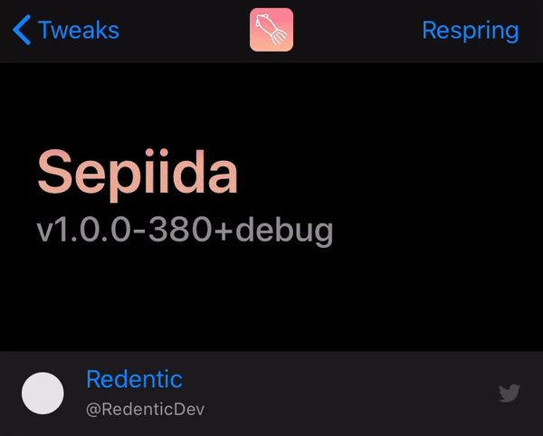
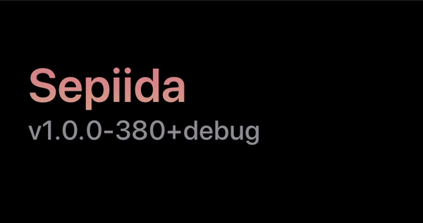
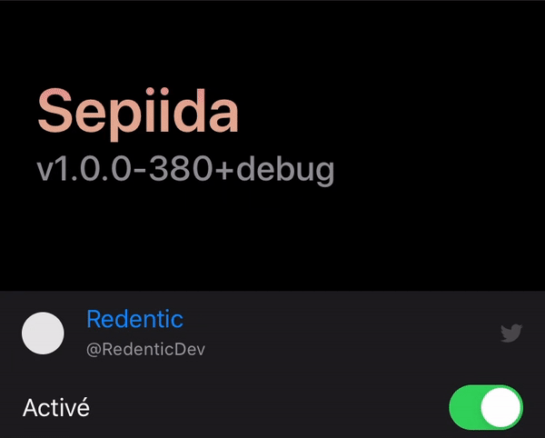

# Animated Banner
Great-looking animated banner for your preferences

## Preview
<figure>
    
    <figcaption>Showcase of the banner</figcaption>
</figure>

## Features
- Simple but nice
- Looks good in both light and dark mode
- Endlessly customizable with animations and gradient
- Stays always vertically centered to fit the space
- Dynamically enabled/disabled by a specifier

## Usage
### Basic implementation
```objective-c
- (void)viewDidLoad {
    [super viewDidLoad];

    NSArray *myUIColorArray = @[
        [UIColor redColor],
        [UIColor blueColor]
    ];
    CGFloat navbarOffset = 64; // default navigation bar height for non-notched devices. Required for scroll animation. Can be obtain with:
    // self.view.window.windowScene.statusBarManager.statusBarFrame.size.height + self.realNavigationController.navigationBar.frame.size.height

    self.table.tableHeaderView = [[XXXAnimatedBanner alloc] initWithTitle:@"Title" subtitle:@"v1.0" colors:myUIColorArray defaultOffset:-navbarOffset];
}
```

### Animate on scroll
```objective-c
- (void)scrollViewDidScroll:(UIScrollView *)scrollView {
    if ([self.table.tableHeaderView isKindOfClass:[SPDAnimatedBanner class]]) {
        [(SPDAnimatedBanner *)self.table.tableHeaderView adjustStackPositionToScrollOffset:scrollView.contentOffset.y];
    }
}
```

### Tip 1: dynamically enable/disable
```objective-c
- (void)setPreferenceValue:(id)value specifier:(PSSpecifier *)specifier {
    [super setPreferenceValue:value specifier:specifier];

    if ([specifier.properties[@"key"] isEqualToString:@"enabled"] && [self.table.tableHeaderView isKindOfClass:[SPDAnimatedBanner class]]) {
        ((SPDAnimatedBanner *)self.table.tableHeaderView).activateGradient = [value boolValue];
    }
}
```

### Tip 2: relaunch animations when they get stopped by iOS
```objective-c
- (void)viewDidLoad {
    [super viewDidLoad];

    self.table.tableHeaderView = [[XXXAnimatedBanner alloc] initWithTitle:...];
    [self refreshBanner];
    [[NSNotificationCenter defaultCenter] addObserver:self selector:@selector(refreshBanner) name:UIApplicationDidBecomeActiveNotification object:nil]; // revive after app closed and reopened
}

- (void)viewWillAppear:(BOOL)animated {
    [super viewWillAppear:animated];

    if (!self.isMovingToParentViewController) [self refreshBanner]; // revive after going in sub pages
}

- (void)refreshBanner {
    if ([self.table.tableHeaderView isKindOfClass:[SPDAnimatedBanner class]]) {
        ((SPDAnimatedBanner *)self.table.tableHeaderView).activateGradient = yourSwitchValue;
    }
}
```

## Gallery
<figure>
    
    <figcaption>Animatable</figcaption>
</figure>
<figure>
    
    <figcaption>Gorgeous in light or dark</figcaption>
</figure>
<figure>
    
    <figcaption>Can be controlled from a specifier</figcaption>
</figure>
