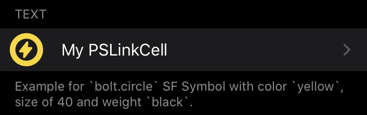

# SFSymbols Link Cell
Allow you to use `PSLinkCell`s that have an [SFSymbol](https://developer.apple.com/design/human-interface-guidelines/sf-symbols/overview/) as icon. (In theory usable with any specifier that supports `icon`)

## Availability
Already available on Cephei ([with my contribution]()!) since v1.1, so it's not needed if you do use it.  

Available for iOS 13+. Will fallback to an image with the same name for versions below, as an usual `PSLinkCell`. Make sure to import images with the same name as the symbol (x1/@2x/@3x) in the same folder as the `plist` file if you want to support older versions.  

You can find out which Symbols are available by using [this Mac app](https://developer.apple.com/sf-symbols/) or [downloading this app](https://github.com/MTACS/Symbols) on your jailbroken device.

## How to use
- Import the `XXXSymbolsLinkCell` files here
- Use it in your `.plist` file as below:
```plist
<!-- Template -->
<!-- Same as a PSLinkCell, but with a cellClass -->
<dict>
    <key>cell</key>
    <string>PSLinkCell</string>
    <key>cellClass</key>
    <string>XXXSymbolsLinkCell</string>
    <key>icon</key>
    <string>YOUR_ICON_NAME</string>
    <key>label</key>
    <string>YOUR_LABEL</string>
    <key>detail</key>
    <string>YOUR_CONTROLLER</string>
    <key>YOUR_PREFIX</key>
    <string>PLIST_TO_LOAD</string>
</dict>

<!-- Example -->
<dict>
    <key>cell</key>
    <string>PSLinkCell</string>
    <key>cellClass</key>
    <string>ABCSymbolsLinkCell</string>
    <key>icon</key>
    <string>circle.lefthalf.fill</string>
    <key>label</key>
    <string>Light and Dark Mode</string>
    <key>detail</key>
    <string>ABCSubListController</string>
    <key>ABCSub</key>
    <string>LightDarkSub</string>
</dict>
```

<figure>
    
    <figcaption>Render of the example</figcaption>
</figure>

## Available options
Customize your cell icon with these premade options.

key | type | values | default
:---:|:---:|:---:|:---:
weight | string | `ultrathin`, `light`, `thin`, `regular`, `medium`, `semibold`, `bold`, `heavy` or `black` | `regular`
size | real | - | `29` (PSLinkCell default)
color | string | an hex value (e.g.: `#ab76e9`) | `#007aff` (system blue)
||| a [system color name](https://developer.apple.com/design/human-interface-guidelines/ios/visual-design/color/#system-colors) (`blue`, `green`, `indigo`, [...], `gray6`) | `blue`
darkColor* | string | an hex value (e.g.: `#ab76e9`) | `#0a84ff` (system 'dark' blue)
||| a [system color name](https://developer.apple.com/design/human-interface-guidelines/ios/visual-design/color/#system-colors) (`blue`, `green`, `indigo`, [...], `gray6`) | `blue`

> *note that `darkColor` is used when the system **is in dark mode**. It will be ignored if `color` isn't specified.

## Preview
<figure>
    
    <figcaption>Cell with default settings</figcaption>
</figure>
<figure>
    
    <figcaption>Cell with several options</figcaption>
</figure>
<figure>
    
    <figcaption>Support for dynamic colors</figcaption>
</figure>
